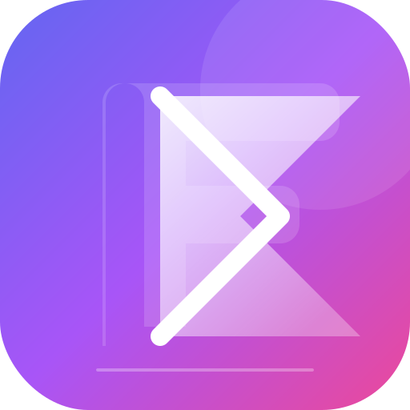
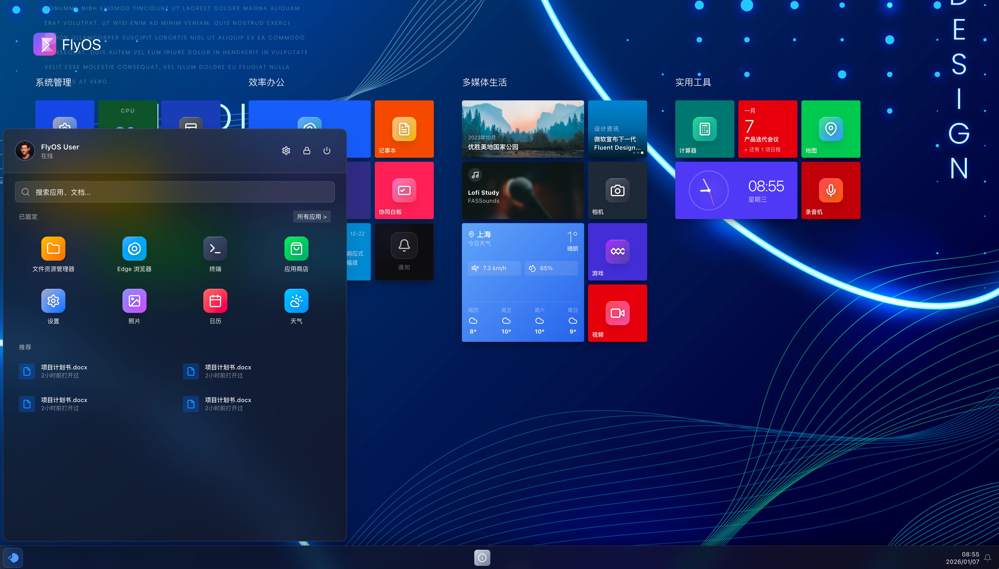
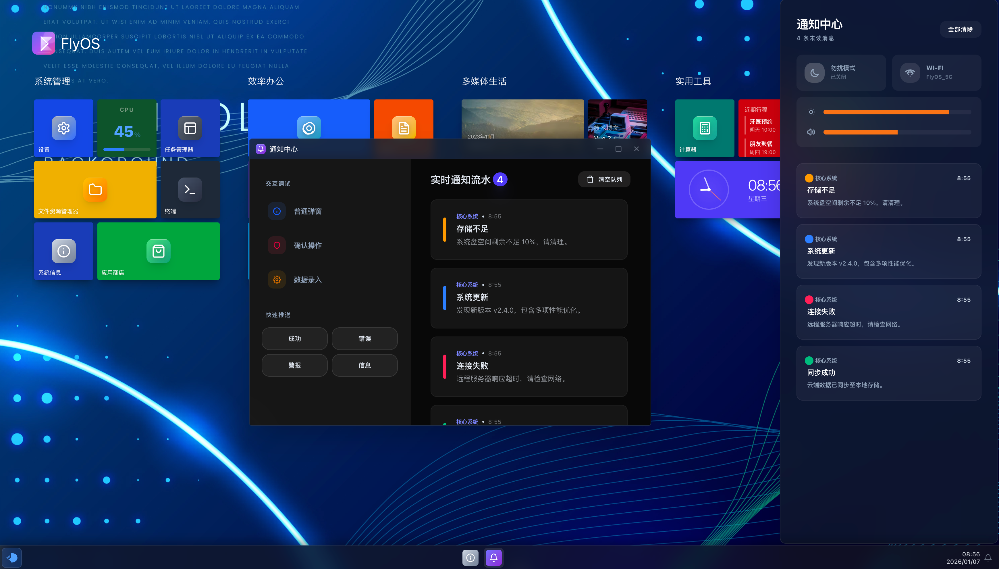
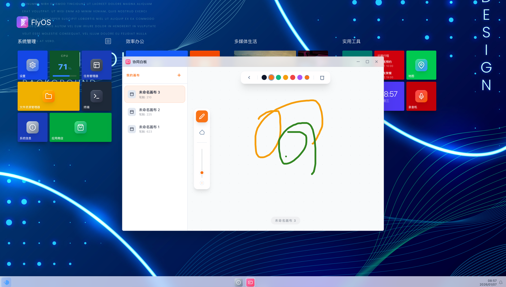

# FlyOS - A Web-Based OS Simulation

<p align="center">
  
</p>

<h3 align="center">
  A modern, open-source Windows 11 clone built with Vue.js and Tailwind CSS.
</h3>

<p align="center">
  <a href="https://flyos-one.vercel.app/"><strong>Live Demo »</strong></a> ·
  <a href="README_zh-CN.md"><strong>中文文档 »</strong></a>
</p>

<p align="center">
  <a href="DOCUMENTATION.md"><strong>Technical Documentation »</strong></a> ·
  <a href="DOCUMENTATION_zh-CN.md"><strong>技术文档 »</strong></a>
</p>

---

## About The Project

FlyOS is an ambitious project to replicate the beautiful and intuitive user interface of Windows 11 in a web browser. It leverages modern web technologies to create a fast, responsive, and feature-rich desktop experience.

This project was bootstrapped with `Vite` and is built upon a component-based architecture, making it modular and easy to maintain.

### Features

- **Windows 11 Inspired UI**: A faithful recreation of the Windows 11 desktop, start menu, taskbar, and widgets.
- **Component-Based Architecture**: Built with Vue 3 components for modularity and reusability.
- **State Management**: Centralized state management using Pinia for predictable state transitions.
- **Draggable and Resizable Windows**: A fully functional window manager for a realistic desktop feel.
- **Customizable Start Menu**: Pin and arrange your favorite applications.
- **A Suite of Built-in Apps**: Includes basic applications like a browser, notepad, terminal, and more.
- **Theming**: Support for light and dark modes.

## Technical Stack

- **[Vue 3](https://vuejs.org/)**: The core progressive JavaScript framework.
- **[Vite](https://vitejs.dev/)**: Next-generation front-end tooling for a fast development experience.
- **[TypeScript](https://www.typescriptlang.org/)**: For robust, statically-typed code.
- **[Tailwind CSS](https://tailwindcss.com/)**: A utility-first CSS framework for rapid UI development.
- **[Pinia](https://pinia.vuejs.org/)**: The official state management library for Vue.
- **[vue-draggable-plus](https://github.com/Alfred-Skyblue/vue-draggable-plus)**: For drag-and-drop functionality.

## Getting Started

To get a local copy up and running, follow these simple steps.

### Prerequisites

- [Node.js](https://nodejs.org/) (v18.x or later)
- [pnpm](https://pnpm.io/) (or npm/yarn)

### Installation

1. **Clone the repo**
   ```sh
   git clone https://github.com/your-username/flyos.git
   cd flyos
   ```

2. **Install dependencies**
   ```sh
   pnpm install
   ```

3. **Run the development server**
   ```sh
   pnpm dev
   ```
   Your application will be available at `http://localhost:5173`.

### Building for Production

To create a production-ready build:
```sh
pnpm build
```
The output will be in the `dist` folder, which can be deployed to any static hosting service.

## Project Structure

The project follows a standard Vue 3 structure:

```
flyos/
├── public/              # Static assets
├── src/
│   ├── apps/            # Vue components for each built-in application
│   ├── assets/          # Images, fonts, etc.
│   ├── components/      # Reusable UI components (Window, Tile, Taskbar, etc.)
│   ├── composables/     # Reusable Vue composition functions
│   ├── stores/          # Pinia stores for state management
│   ├── styles/          # Global styles and fonts
│   ├── tiles/           # Components for live tiles in the start menu
│   ├── types/           # TypeScript type definitions
│   ├── App.vue          # Main application component
│   └── main.ts          # Application entry point
├── package.json
└── vite.config.ts
```

## Screenshots

<p align="center">
  
</p>

<p align="center">
  
</p>
<p align="center">
  
</p>
<p align="center">
  
</p>


## Contributing

Contributions are what make the open-source community such an amazing place to learn, inspire, and create. Any contributions you make are **greatly appreciated**.

If you have a suggestion that would make this better, please fork the repo and create a pull request. You can also simply open an issue with the tag "enhancement".

## License

Distributed under the Apache License. See `LICENSE` for more information.
